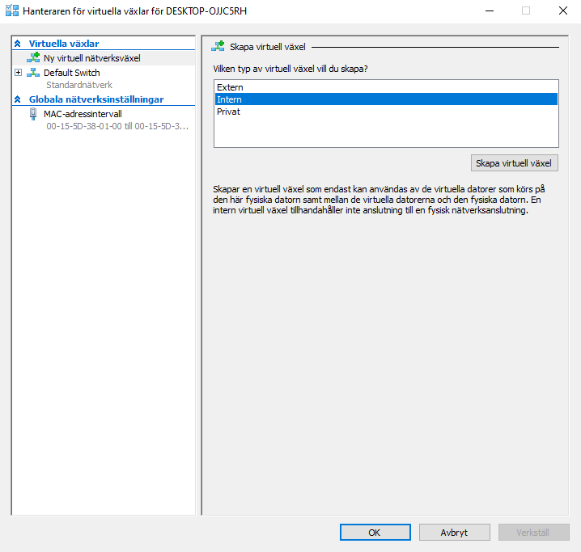
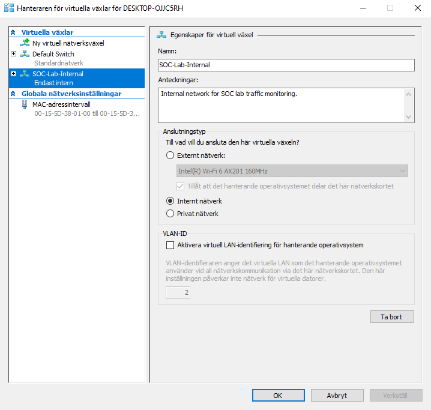

## Step 1 - Hyper-V Network Design

### Objective
Design a simple but realistic network layout for the SOC lab to support monitoring, detection, and investigation activities.

### Network Overview
The lab uses a single internal Hyper-V virtual switch to simulate an isolated enterprise network.

### Virtual Switch Creation
An internal virtual switch named `SOC-Lab-Internal` was created to isolate the SOC lab environment while allowing controlled communication between lab systems.

### Why This Matters for SOC
This network design allows:
- Controlled east-west traffic between hosts
- Safe attack simulation without internet exposure
- Realistic alert generation for Tier 1 and Tier 2 SOC workflows
