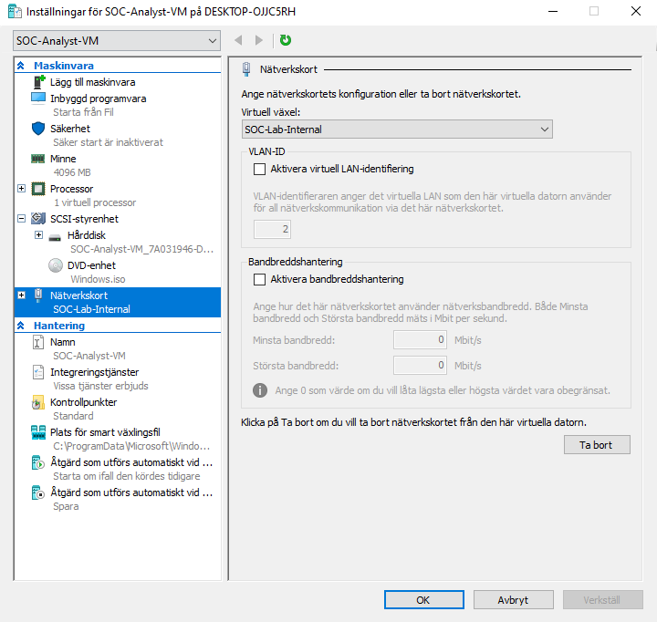
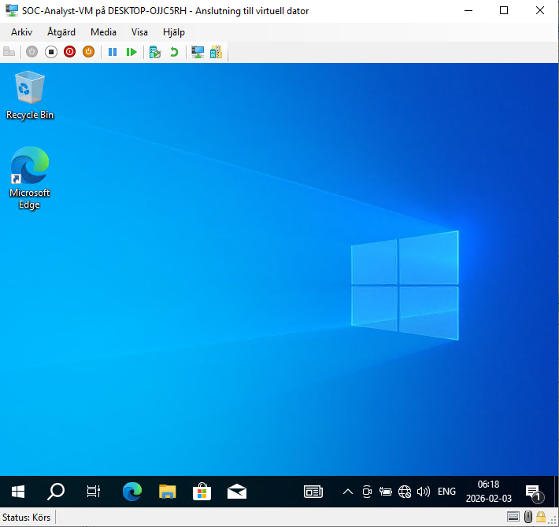
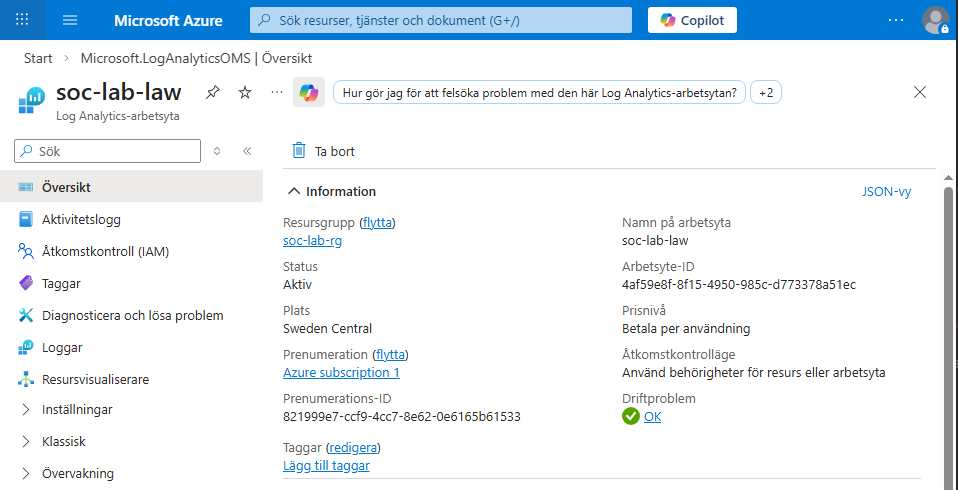
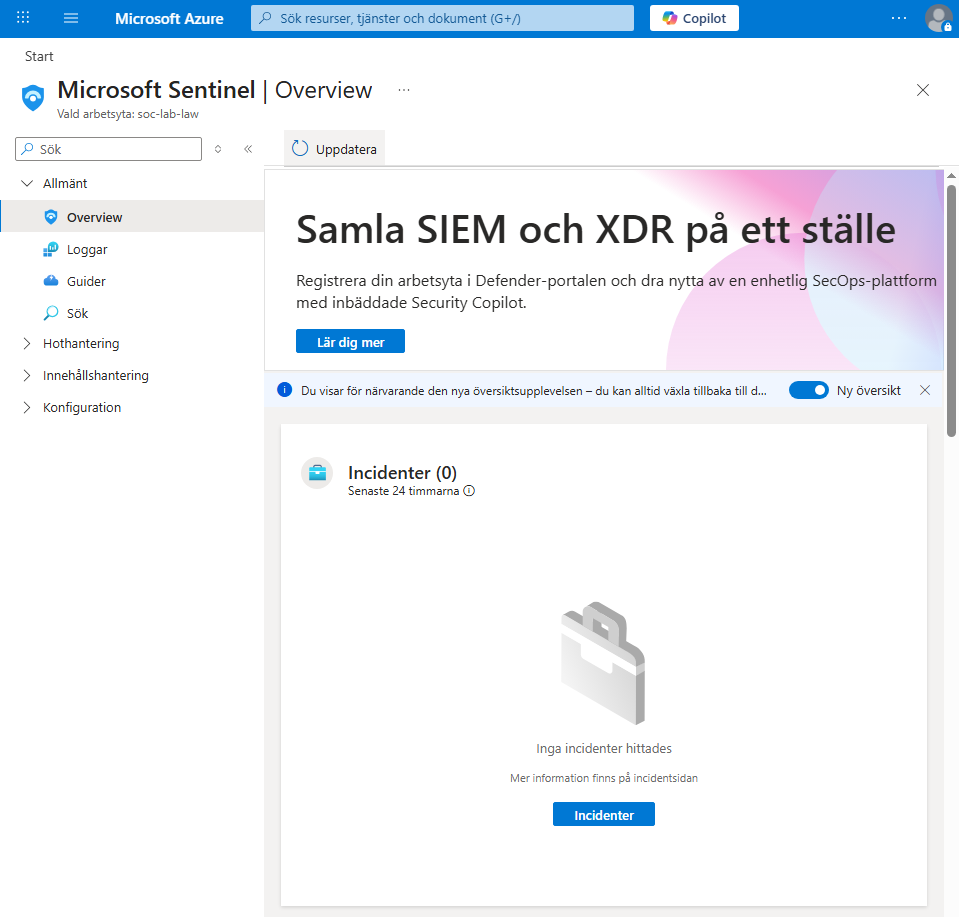

# Setup Documentation

This section documents the step-by-step setup of the lab environment.

## Step 2.1 – SOC Analyst VM

### Objective
Create a dedicated SOC analyst workstation to interact with Microsoft Sentinel and perform alert triage and investigations.

### VM Details
- Name: SOC-Analyst-VM
- OS: Windows 10 Pro
- Platform: Hyper-V
- Network: SOC-Lab-Internal

### Verification
The SOC analyst VM was successfully deployed and connected to the isolated lab network.

### Why This Matters for SOC
SOC analysts typically work from client systems while the SIEM runs in the cloud. This setup reflects a realistic SOC workflow.

## Step 2.2: Create Log Analytics Workspace

In this step I set up the logging backend for my SOC lab SIEM.  
A dedicated Log Analytics Workspace is used as the central location for security telemetry.

I used a dedicated resource group and chose Sweden Central as region.  
Log ingestion is intentionally not enabled yet to avoid any cost during the Azure Free Trial.

### Workspace overview

Here is the workspace overview right after creation:

This shows the workspace name, resource group and region.

### Cost validation

I verified the workspace usage immediately after creation to ensure that no logs are being ingested and that the estimated cost remains zero.

At this stage the workspace shows:
- 0 GB ingested
- Estimated cost 0 USD

This confirms that I stay within Free Trial limits.

### Current status

The Log Analytics Workspace is ready and prepared for Microsoft Sentinel in the next step.  
No logs are ingested yet and no costs are generated.

### Microsoft Sentinel activation

Microsoft Sentinel was enabled on the existing Log Analytics Workspace to prepare the SIEM layer of the SOC lab.

At this stage, Sentinel is active but no data sources are connected.  
This is an intentional state to verify the SIEM setup before enabling log ingestion.

---

### Sentinel analyst view

The Sentinel interface was reviewed to confirm access to core analyst features such as incidents, logs, and data connectors.

## Step 2.3: Azure Activity Logs (initial ingestion)

In this step I configured Azure Activity Logs as the first data source for the SOC lab SIEM.

Azure Activity Logs were selected to provide visibility into subscription-level administrative actions such as resource creation, deletion, and configuration changes.

### Configuration

Azure Activity Logs were connected to the Log Analytics Workspace using Azure Monitor diagnostic settings.

- Diagnostic setting created at subscription level
- All standard Activity Log categories enabled
- Logs forwarded to the SOC lab Log Analytics Workspace

---

### Verification and troubleshooting

After configuration, multiple controlled subscription-level activities were generated to validate log ingestion.

During the verification window, no Azure Activity events were observed in the workspace.  
This was identified as initial ingestion latency in a newly created Azure Free Trial tenant.

The diagnostic configuration was validated and left in place for future ingestion.

---

### Current status

Azure Activity Logs are correctly configured and connected.  
Log ingestion is pending and expected to become available after initial platform latency.

The SOC lab setup continues with alternative telemetry sources to ensure reliable data ingestion.
